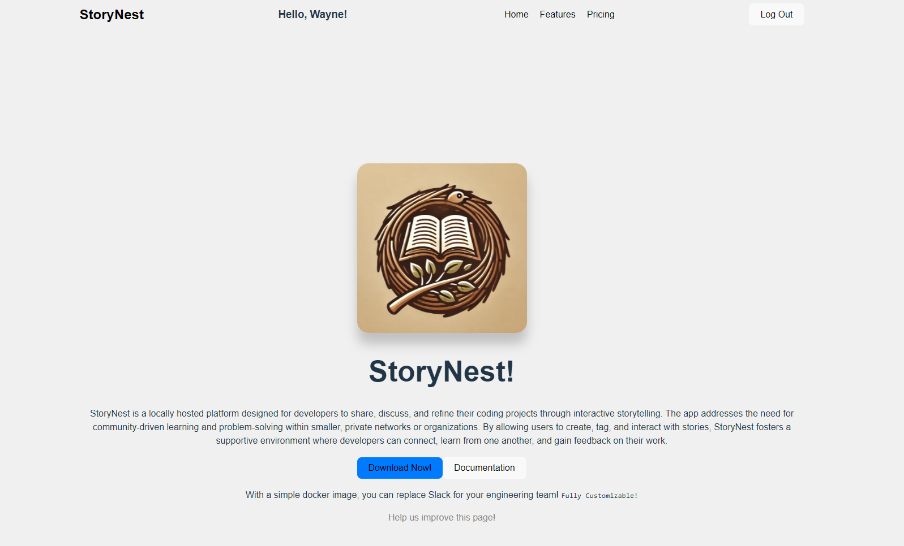
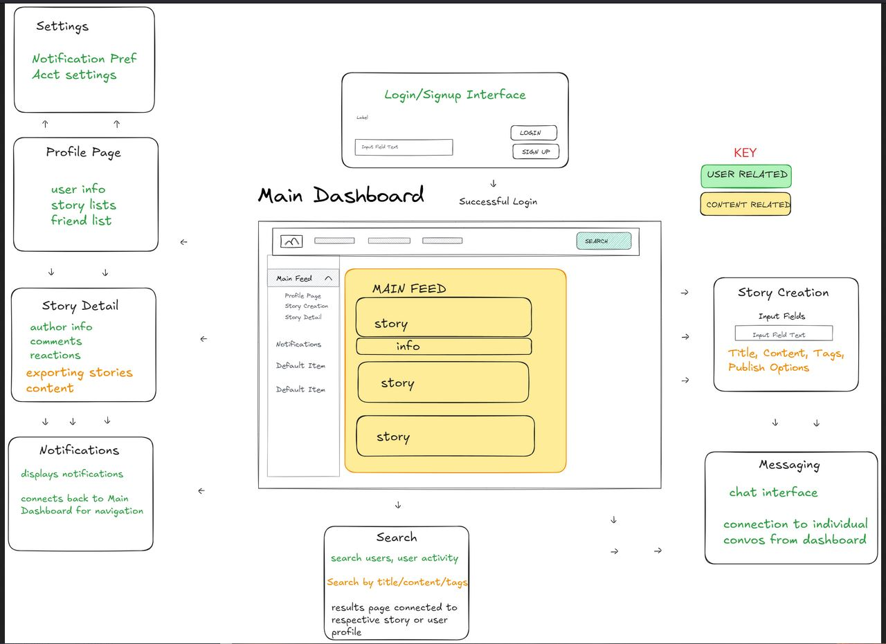

# StoryNest

A locally hosted platform for developers to share, discuss, and refine coding projects through interactive storytelling.



## Overview

StoryNest addresses the need for community-driven learning and problem-solving within smaller, private networks or organizations. By allowing users to create, tag, and interact with stories, StoryNest fosters a supportive environment where developers can connect, learn from one another, and gain feedback on their work.

**Mission:** Empowering developers to collaborate, learn, and grow through the art of storytelling.

**Vision:** To create a thriving community where every developer's journey is shared, celebrated, and enriched by collective knowledge.

## Features

### Core Features
- **User Authentication** - Secure login via Auth0 with social providers and email authentication
- **Story Management** - Full CRUD operations for creating, reading, updating, and deleting stories
- **Story Feed** - Browse and discover stories from the community
- **Comments** - Add, edit, and delete comments on stories
- **Reactions** - Like and dislike stories to show your feedback
- **Tags** - Categorize stories with tags for better organization

### Coming Soon
- User profiles and activity tracking
- Search functionality for users and stories
- Notifications system
- Direct messaging between users
- Export stories as PDF/Word documents

## Tech Stack

**Frontend:**
- React 18
- Vite
- React Router DOM
- Auth0 for authentication
- Axios for API calls

**Backend:**
- Python (FastAPI)
- PostgreSQL database

## Getting Started

### Prerequisites

- Node.js 18+ and npm
- A running StoryNest backend server
- Auth0 account for authentication

### Installation

1. **Clone the repository**
   ```bash
   git clone https://github.com/your-username/storynest.git
   cd storynest
   ```

2. **Install dependencies**
   ```bash
   npm install
   ```

3. **Configure environment variables**

   Copy the example environment file and fill in your values:
   ```bash
   cp .env.example .env
   ```

   Edit `.env` with your configuration:
   ```env
   VITE_AUTH0_DOMAIN=your-tenant.auth0.com
   VITE_AUTH0_CLIENT_ID=your_client_id
   VITE_REDIRECT_URI=http://localhost:5173
   VITE_BACKEND_URL=http://localhost:8000
   ```

4. **Start the development server**
   ```bash
   npm run dev
   ```

5. **Open your browser**

   Navigate to `http://localhost:5173`

### Auth0 Setup

1. Create a free account at [Auth0](https://auth0.com)
2. Create a new Single Page Application
3. Configure the following in your Auth0 application settings:
   - **Allowed Callback URLs:** `http://localhost:5173`
   - **Allowed Logout URLs:** `http://localhost:5173`
   - **Allowed Web Origins:** `http://localhost:5173`
4. Copy your Domain and Client ID to your `.env` file

## Project Structure

```
storynest/
├── src/
│   ├── api/           # API client and endpoints
│   ├── components/    # Reusable React components
│   ├── context/       # React Context for state management
│   ├── pages/         # Page components
│   ├── assets/        # Images and static assets
│   ├── App.jsx        # Main application component
│   └── main.jsx       # Application entry point
├── public/            # Static public assets
└── index.html         # HTML template
```

## API Endpoints

### Stories
| Method | Endpoint | Description |
|--------|----------|-------------|
| GET | `/api/stories/` | Get all stories |
| GET | `/api/stories/{id}/` | Get a specific story |
| POST | `/api/stories/` | Create a new story |
| PUT | `/api/stories/{id}/` | Update a story |
| DELETE | `/api/stories/{id}/` | Delete a story |

### Comments
| Method | Endpoint | Description |
|--------|----------|-------------|
| GET | `/api/stories/{story_id}/comments/` | Get comments for a story |
| POST | `/api/stories/{story_id}/comments/` | Add a comment |
| PUT | `/api/comments/{id}/` | Update a comment |
| DELETE | `/api/comments/{id}/` | Delete a comment |

## Available Scripts

```bash
npm run dev      # Start development server
npm run build    # Build for production
npm run preview  # Preview production build
npm run lint     # Run ESLint
```

## Wireframe



## Authors

- **Jay Yong**
- **Wayne Beckom**

## License

This project is private and intended for local/organizational use.
